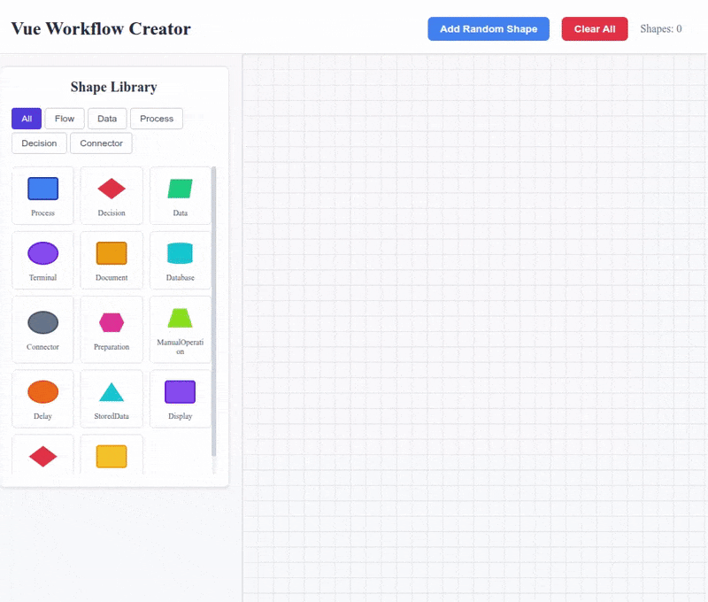

# Vue Workflow Creator

A comprehensive study application for understanding how to build complex visual components using Vue.js 3 with TypeScript. This project demonstrates advanced UI patterns, interactive graphics, and state management in a workflow diagram editor.

## 📖 About This Study Application

This is an educational project designed to explore and demonstrate various advanced Vue.js concepts and patterns for building interactive visual applications. The application implements a workflow diagram editor where users can create, connect, and manipulate shapes to build flow diagrams.

### What it does

The Vue Workflow Creator is a visual diagram editor that allows users to:

- **Create Shapes**: Add various types of flowchart shapes (Process, Decision, Data, Terminal, etc.)
- **Interactive Manipulation**: Drag shapes around the canvas and resize them with visual handles
- **Connection System**: Right-click shapes to enter "anchor mode" and create connections between shapes with directional arrows
- **Shape Library**: Browse and select from 14 different shape types with unique geometries
- **Visual Feedback**: Real-time visual feedback for interactions, hover effects, and state changes

## 🎥 Demo



_The demo shows the interactive features: creating shapes, dragging them around, resizing, entering anchor mode, and creating connections between shapes._

## 🏗️ Architecture

This project implements **Vertical Sliced Architecture** (Feature-Based Architecture) with the following structure:

```
src/
├── features/           # Business-focused features
│   ├── shapes/        # Shape management (creation, interaction, rendering)
│   ├── connections/   # Connection system between shapes
│   ├── canvas/        # Workspace and grid system
│   └── toolbar/       # Application toolbar
├── shared/            # Shared utilities and types
├── app/               # Application orchestration
└── components/        # Legacy shape renderer components
```

### Key Architectural Patterns Demonstrated

- **Feature-Based Architecture**: Organizing code by business capabilities rather than technical layers
- **Composable Pattern**: Vue 3 composition API for reusable logic
- **State Management**: Pinia stores for reactive state management
- **Component Communication**: Event-driven communication between features
- **TypeScript Integration**: Full type safety across the application

## 🚀 Getting Started

### Prerequisites

- Node.js 18+
- npm or yarn package manager

### Installation

1. Clone the repository:

```bash
git clone https://github.com/fabiomdf/vue-workflow-creator.git
cd vue-workflow-creator
```

2. Install dependencies:

```bash
npm install
```

### Development

Start the development server:

```bash
npm run dev
```

The application will be available at `http://localhost:5173`

### Building for Production

Build the application:

```bash
npm run build
```

The built files will be in the `dist/` directory.

### Type Checking

Run TypeScript type checking:

```bash
npm run type-check
```

### Testing

Run the test suite:

```bash
npm run test:unit
```

Run end-to-end tests:

```bash
# Install browsers for the first run
npx playwright install

# When testing on CI, must build the project first
npm run build

# Runs the end-to-end tests
npm run test:e2e
```

### Lint with [ESLint](https://eslint.org/)

```bash
npm run lint
```

## 🎯 Learning Objectives

This study application demonstrates several complex frontend development concepts:

### 1. **Interactive Graphics & SVG Manipulation**

- Custom shape rendering with dynamic SVG generation
- Interactive drag-and-drop with mouse event handling
- Visual connection lines with Bézier curves and directional arrows

### 2. **Complex State Management**

- Multi-feature state coordination using Pinia
- Reactive updates across multiple components
- Event-driven communication between isolated features

### 3. **Advanced Vue.js Patterns**

- Composition API for reusable logic extraction
- Custom composables for interaction behaviors
- Component communication through events and stores

### 4. **TypeScript in Vue Applications**

- Full type safety for component props and events
- Type-safe store definitions and actions
- Interface design for complex data structures

### 5. **Architecture Patterns**

- Vertical Sliced Architecture implementation
- Feature-based code organization
- Separation of concerns between UI and business logic

## 🔧 Technical Features

### Shape System

- **14 Different Shape Types**: Process, Decision, Data, Terminal, Document, Database, etc.
- **Dynamic Rendering**: SVG-based shape rendering with configurable colors and sizes
- **Interactive Handles**: Visual resize handles that appear on hover/selection
- **Context Menus**: Right-click to toggle anchor mode

### Connection System

- **Anchor Points**: Visual connection points on shape edges
- **Smart Routing**: Automatic curve generation between connection points
- **Directional Arrows**: Arrow heads that point toward the target shape
- **Visual Feedback**: Hover effects and connection state indication

### Canvas Features

- **Grid Background**: Optional grid for visual alignment
- **Zoom & Pan**: Canvas navigation capabilities (extensible)
- **Responsive Layout**: Adaptive sidebar and canvas sizing

## 📚 Technologies Used

- **Vue.js 3**: Progressive JavaScript framework with Composition API
- **TypeScript**: Type-safe JavaScript development
- **Pinia**: State management for Vue applications
- **Vite**: Fast build tool and development server
- **Vitest**: Unit testing framework
- **Playwright**: End-to-end testing
- **ESLint**: Code linting and style enforcement

## 🎨 UI/UX Features

- **Responsive Design**: Works on different screen sizes
- **Visual Feedback**: Hover effects, selection states, and transitions
- **Intuitive Interactions**: Click-and-drag, right-click context actions
- **Clean Interface**: Modern, minimal design focusing on functionality

## 📖 Code Examples

### Creating a Shape Factory

```typescript
export class ShapeFactory {
  static create(type: ShapeType, position: Position): Shape {
    const config = this.getConfig(type)
    return {
      id: generateId('shape_'),
      position,
      type,
      geometry: config.geometry,
      style: {
        /* ... */
      },
    }
  }
}
```

### Drag Interaction Composable

```typescript
export function useShapeInteractions(config: ShapeInteractionConfig) {
  const position = ref(config.initialPosition)
  const isDragging = ref(false)

  const startDrag = (event: MouseEvent) => {
    // Mouse event handling logic
  }

  return { position, isDragging, startDrag }
}
```

## 🤝 Contributing

This is a study project, but contributions for educational improvements are welcome! Please feel free to:

- Add new shape types or interaction patterns
- Improve the architecture or add new features
- Fix bugs or enhance documentation
- Share feedback or suggest learning improvements

## 📄 License

This project is open source and available under the [MIT License](LICENSE).

## 🎓 Educational Value

This project serves as a comprehensive example of:

- Building interactive visual applications with Vue.js
- Implementing complex user interactions and state management
- Structuring large frontend applications with maintainable architecture
- Integrating TypeScript for type-safe development
- Creating reusable and composable code patterns

Perfect for developers looking to understand advanced Vue.js patterns and interactive UI development techniques.
